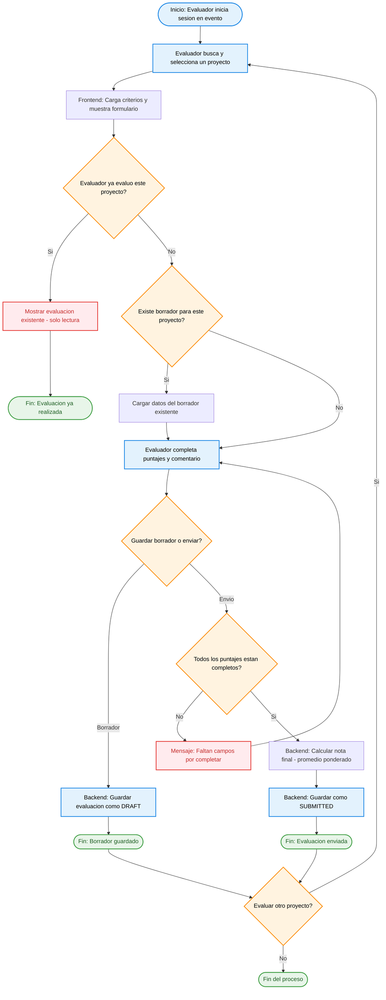

# Flujo de Evaluación - Hyōsei

Diagrama de flujo que muestra el proceso completo de evaluación de un proyecto, incluyendo validaciones, borradores y envío.

```mermaid
graph TD
    %% Definición de estilos
    classDef actor fill:#e3f2fd,stroke:#1e88e5,stroke-width:2px,color:#000000;
    classDef decision fill:#fff3e0,stroke:#fb8c00,stroke-width:2px,color:#000000;
    classDef error fill:#ffebee,stroke:#e53935,stroke-width:2px,color:#c62828;
    classDef final fill:#e8f5e9,stroke:#43a047,stroke-width:2px,color:#1b5e20;

    %% Nodos del diagrama
    Inicio([Inicio: Evaluador inicia sesion en evento]):::actor

    SeleccionarProyecto[Evaluador busca y selecciona un proyecto]:::actor
    CargarFormulario[Frontend: Carga criterios y muestra formulario]

    VerificarEvaluacionPrevia{Evaluador ya evaluo este proyecto?}:::decision
    MostrarEvaluacionExistente[Mostrar evaluacion existente - solo lectura]:::error
    FinEvaluacionExistente([Fin: Evaluacion ya realizada]):::final

    VerificarBorradorExistente{Existe borrador para este proyecto?}:::decision
    CargarBorradorExistente[Cargar datos del borrador existente]

    CompletarFormulario[Evaluador completa puntajes y comentario]:::actor
    DecisionGuardar{Guardar borrador o enviar?}:::decision

    GuardarBorrador[Backend: Guardar evaluacion como DRAFT]:::actor
    FinBorrador([Fin: Borrador guardado]):::final

    ValidarCampos{Todos los puntajes estan completos?}:::decision
    ErrorCampos[Mensaje: Faltan campos por completar]:::error

    CalcularNota[Backend: Calcular nota final - promedio ponderado]
    GuardarEnviado[Backend: Guardar como SUBMITTED]:::actor
    FinEnvio([Fin: Evaluacion enviada]):::final

    DecisionRepetir{Evaluar otro proyecto?}:::decision

    %% Conexiones (flechas)
    Inicio --> SeleccionarProyecto
    SeleccionarProyecto --> CargarFormulario

    CargarFormulario --> VerificarEvaluacionPrevia
    VerificarEvaluacionPrevia -- Si --> MostrarEvaluacionExistente
    MostrarEvaluacionExistente --> FinEvaluacionExistente

    VerificarEvaluacionPrevia -- No --> VerificarBorradorExistente
    VerificarBorradorExistente -- Si --> CargarBorradorExistente
    CargarBorradorExistente --> CompletarFormulario

    VerificarBorradorExistente -- No --> CompletarFormulario
    CompletarFormulario --> DecisionGuardar

    %% Rama de Borrador
    DecisionGuardar -- Borrador --> GuardarBorrador
    GuardarBorrador --> FinBorrador
    FinBorrador --> DecisionRepetir

    %% Rama de Envio
    DecisionGuardar -- Envio --> ValidarCampos
    ValidarCampos -- No --> ErrorCampos
    ErrorCampos --> CompletarFormulario

    ValidarCampos -- Si --> CalcularNota
    CalcularNota --> GuardarEnviado
    GuardarEnviado --> FinEnvio
    FinEnvio --> DecisionRepetir

    %% Bucle de repeticion
    DecisionRepetir -- Si --> SeleccionarProyecto
    DecisionRepetir -- No --> Fin([Fin del proceso]):::final
```
