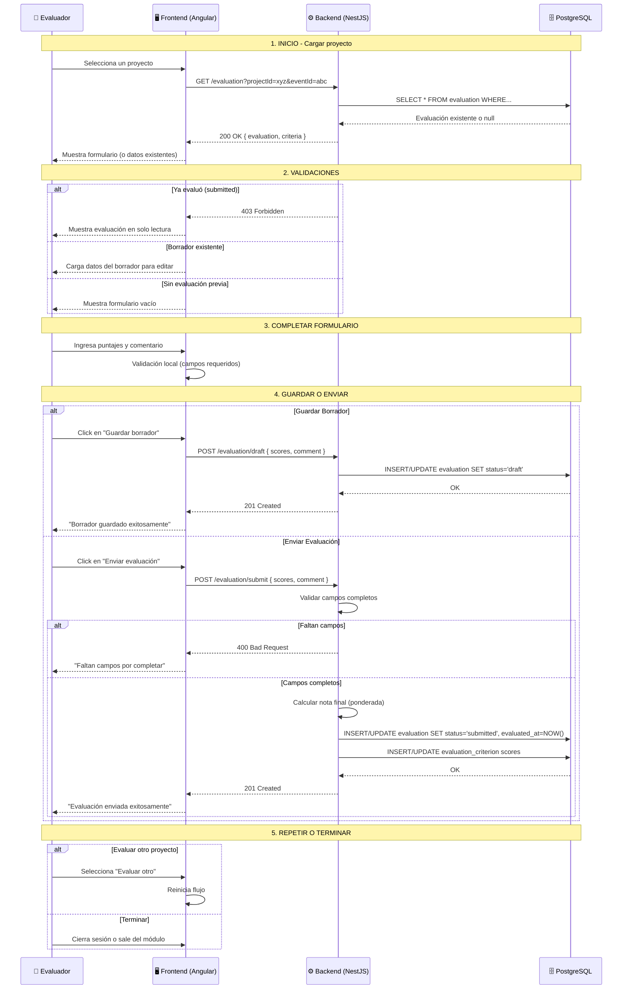

# Secuencia de Evaluación - Hyōsei

Diagrama de secuencia que muestra la interacción temporal entre el evaluador, frontend, backend y base de datos durante el proceso de evaluación.

```mermaid
sequenceDiagram
    participant User as 👤 Evaluador
    participant Frontend as 🖥️ Frontend (Angular)
    participant Backend as ⚙️ Backend (NestJS)
    participant DB as 🗄️ PostgreSQL

    Note over User,DB: 1. INICIO - Cargar proyecto
    User->>Frontend: Selecciona un proyecto
    Frontend->>Backend: GET /evaluation?projectId=xyz&eventId=abc
    Backend->>DB: SELECT * FROM evaluation WHERE...
    DB-->>Backend: Evaluación existente o null
    Backend-->>Frontend: 200 OK { evaluation, criteria }
    Frontend-->>User: Muestra formulario (o datos existentes)

    Note over User,DB: 2. VALIDACIONES
    alt Ya evaluó (submitted)
        Backend-->>Frontend: 403 Forbidden
        Frontend-->>User: Muestra evaluación en solo lectura
    else Borrador existente
        Frontend-->>User: Carga datos del borrador para editar
    else Sin evaluación previa
        Frontend-->>User: Muestra formulario vacío
    end

    Note over User,DB: 3. COMPLETAR FORMULARIO
    User->>Frontend: Ingresa puntajes y comentario
    Frontend->>Frontend: Validación local (campos requeridos)

    Note over User,DB: 4. GUARDAR O ENVIAR
    alt Guardar Borrador
        User->>Frontend: Click en "Guardar borrador"
        Frontend->>Backend: POST /evaluation/draft { scores, comment }
        Backend->>DB: INSERT/UPDATE evaluation SET status='draft'
        DB-->>Backend: OK
        Backend-->>Frontend: 201 Created
        Frontend-->>User: "Borrador guardado exitosamente"
    else Enviar Evaluación
        User->>Frontend: Click en "Enviar evaluación"
        Frontend->>Backend: POST /evaluation/submit { scores, comment }

        Backend->>Backend: Validar campos completos
        alt Faltan campos
            Backend-->>Frontend: 400 Bad Request
            Frontend-->>User: "Faltan campos por completar"
        else Campos completos
            Backend->>Backend: Calcular nota final (ponderada)
            Backend->>DB: INSERT/UPDATE evaluation SET status='submitted', evaluated_at=NOW()
            Backend->>DB: INSERT/UPDATE evaluation_criterion scores
            DB-->>Backend: OK
            Backend-->>Frontend: 201 Created
            Frontend-->>User: "Evaluación enviada exitosamente"
        end
    end

    Note over User,DB: 5. REPETIR O TERMINAR
    alt Evaluar otro proyecto
        User->>Frontend: Selecciona "Evaluar otro"
        Frontend->>Frontend: Reinicia flujo
    else Terminar
        User->>Frontend: Cierra sesión o sale del módulo
    end
```
